# IntelliWAF

> An ML-powered Web Application Firewall that classifies the firewall action based on request features.

This project involves experimenting with various statistical learning methods to compare and find a method that best classifies the action of the firewall requests as one to be allowed, denied, dropped, or drop and reset.

### What is a firewall?

Web Application Firewall filters monitors and blocks requests to and from a web service. Firewalls have manually configured rules that decide if the request is to be allowed, denied, or dropped. One of the most important tasks of a firewall is to block requests from suspicious networks by inspecting the request’s source/destination IP addresses and ports, packet information, etc based on pre-configured rules.

**Problem** - Manually configured rules are prone to errors and loopholes. They also require tremendous domain knowledge and in most huge firewalls, require, time and resources. Can this be automated based on the historic firewall logs?

**Solution** - Every firewall have millions of request data logged. We may be able to let a machine learning algorithm decide the request action based on historical decisions.

## I. Data Preparation

The [Internet Firewall Data Set](https://archive.ics.uci.edu/ml/datasets/Internet+Firewall+Data#) available in the [UCI Machine Learning Repository](https://archive.ics.uci.edu/ml/index.php) is used for this analysis.

The following are the properties of the dataset:

| | |
------------------------|----------
**Number of Instances** | 65532
**Number of Predictors** | 11
**Class Variable** | Action
**Number of levels** | 4
**Missing Values** | No  

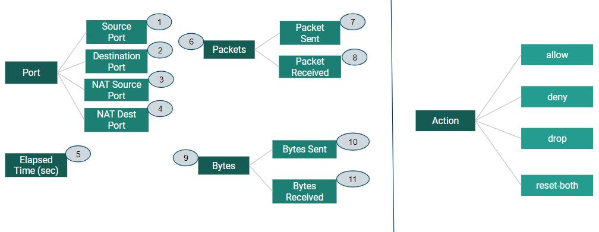 

* There are 11 predictors in the data that can be broadly classified into four categories.

* There are four levels in the class variable <em>Action</em> \
	i) **allow** - Good traffic, allow it to hit the server. \
	ii) **deny** - Block the request and respond to sender about denied access. \
	iii) **drop** - Silently drop the request. \
	iv) **reset-both** - Request is blocked, RST is sent to end the connection

### 1. Balancing the Classes

> More often than not, a firewall allow requests through to hit the web service. As a result, we will be dealing with an imbalanced dataset problem.

We see that 57% of the requests belong to the "allow" class and as low as 0.0008% belong to the "reset-both" class.

| allow | deny | drop | reset-both |
|--------|------|------|-----------|
| 37640 | 14987 | 12851 | 54 |

##### Confusion Matrix <sub>(random forest)</sub> =

| | allow | deny | drop | reset-both | class error |
|-|-------|------|------|-----------|------|
| **allow**| 28183 | 9 | 0 | 1 | 0.00032 |
| **deny**| 4 | 11267 | 24 | 0 | 0.0025 |
| **drop**| 0 | 0 | 9619 | 0 | 0.00 |
| **reset-both**| 0 | 33 | 0 | 10 | **<em>0.77</em>**

##### Misclassification Rate <sub>(random forest)</sub> = 0.0015

The problem here is apparent. Using a random forest classifier, we see from the confusion matrix of the predicted and ground truth that the class error for "reset-both" is the highest (0.77) because there is just not enough data to predict this class with confidence. However, we also see that the misclassification rate is still quite low (0.0015) indicating that the high error rate from class 4 is not contributing to the misclassification rates at all due to its small number.

Thus, we will need to balance the classes before we proceed further to applying ML algorithms. I have used two sequential techniques in order to effectively balance the classes:

1.  Synthetic Minority Oversampling Technique (SMOTE):

| allow | deny | drop | reset-both |
|-------|------|------|------------|
| 572   | 183  | 163  | 162        |

2. Undersampling:

| allow | deny | drop | reset-both |
|--------|------|------|-----------|
| 162 | 162 | 162 | 162 |

### 2. Scaling the Features:

The summary of the original data suggests that features like packets (mean~12.7) and bytes (mean~17614) are on entirely different scales and need to be standardized (sd=1). This is especially important for algorithms like KNN so the distance is not dominated by different scalings.

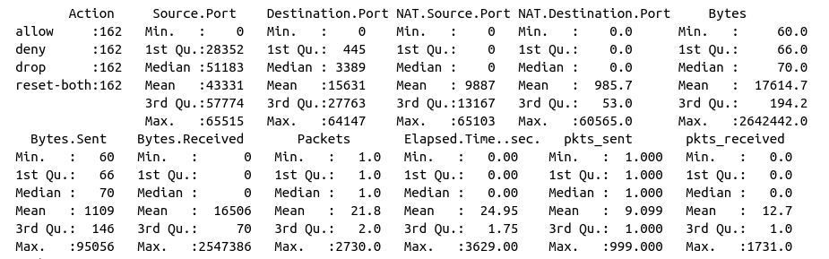

After scaling the train, the features would have standard deviation of 1. The test split is then scaled based on the sclaed train split.

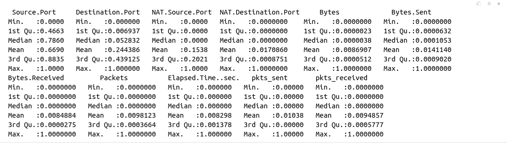

### 3. Feature Correlation:

> It is important to identify highly correlated features and exclude noise in the data during the train. 

In an effort to do this, created a correlation matrix to understand the nature of variables. We can see that features like Bytes are highly correlated with Bytes Sent and Received, Packets with Packets Sent and Received. The names suggest that the data may be hierarchical. We will see later if these variables are actually considered for predictions.

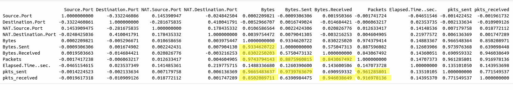

### 4. Variable Importance:

To have an idea of what variables may be used as predictors, applied the data on a random forest classifier and plotted the variable importances.

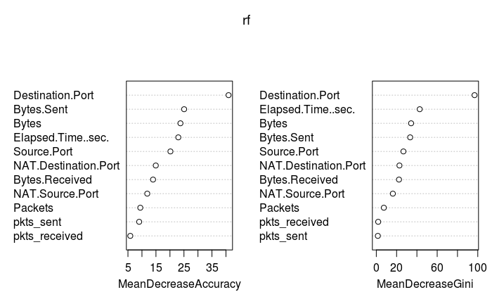

*   Destination.Port seem like the most important variable.
*	Bytes, Bytes Sent and elapsed time also seem to be helping in predictions.

> UDP flooding (DoS) is identified by monitoring traffic on irregular ports and firewalls are generally configured to allow traffic only on required ports. This domain knowledge aligns with the algorithm identifying <em>Destination.Port</em> as the most important feature!

## II. Algorithms

Applied and compared the following classification algorithms (tuned) on the data:
1. K-Nearest Neighbors
2. Logistic Regression
3. Logistic Regression <sub>LASSO</sub>
4. Linear Discriminant Analysis (LDA)
5. Naive Bayes <em>(with Principal Components and Kernel Density Estimation)</em>
6. Single Tree <em>(pruned 1SE)</em>
7. Random Forest
8. Neural Network
9. Support Vector Machine (SVM)
  
### I. Identify a good range of hyper-parameters for tuning:

After randomly splitting data in the ratio 75:25, tuning KNN, Random Forest, Neural Network, and SVM on the train split repeatedly using cross validation. Remember, we are doing this just to get an idea of what range of parameters might work best for eahc of the tunable algorithms and we are not comparing any models here.

1. **KNN** <sub>(Kmax=40)</sub>:
Best k according to the 1SE rule is k=3 (mis⋍0.15) which is close to best performing model (k=1, mis⋍0.105).

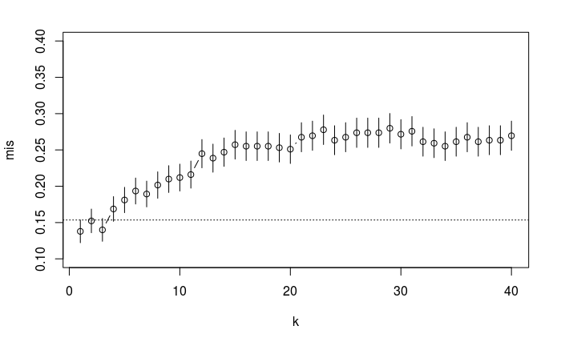

2. **Random Forest** : 
* Tuned using a grid of mtry=(2,4,6,8,10) and nodesize=(2,4,6,8,10) using repeated RF cross validation OOB errors on train split. Lower values of mtry (<=4) and higher values of nodesizes (>=4) are not working well. It may get better if we narrow down our search around mtry>8 and nodesize<6.

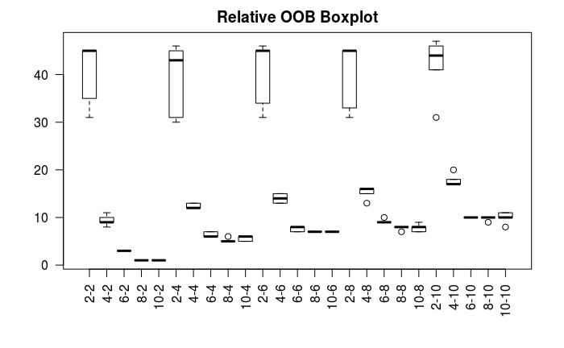

* Narrowing down our search, fine-tuned again using a grid of mtry=(6,8,9,10,12) and nodesize=(2,3,4,5,6) using repeated cross validation on the train split. Tries = (8,9,10,12) are doing well with nodesize=2. Best set of parameters with lowest misclassification rate in this case would be mtry=8 and nodesize=2.

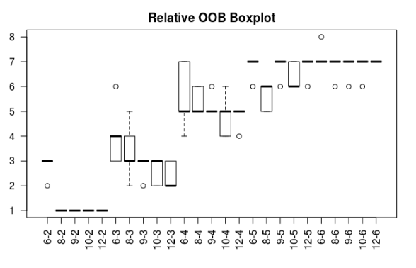

3.  **Neural Network**:
Tuned using a grid of size=(2,6,9,12) and decay=(0,0.001,0.01,0.1) using repeated cross validation on train split. decay=0.1 is clearly a bad choice in this case. The best set of parameters seem to be size=9 and decay=0.001.

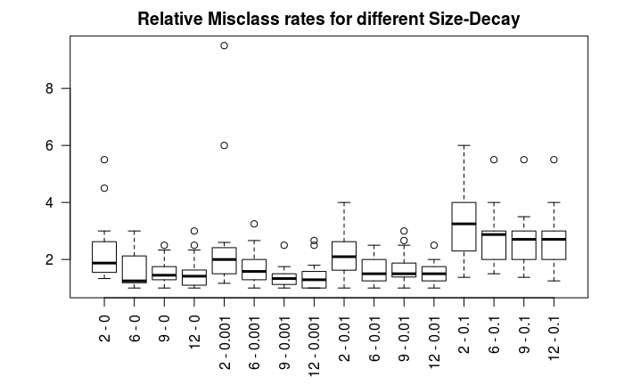
  
4. **Support Vector Machine**:
Tuned using a grid of cost = (1, 10, 10<sup>2</sup>, 10<sup>3</sup>, 10<sup>4</sup>, 10<sup>5</sup>) and sigma = (10<sup>-5</sup>, 10<sup>-4</sup>, 10<sup>-3</sup>, 10<sup>-2</sup>, 10<sup>-1</sup>,1) using cross validation on train split. Cost=1 is clearly not working well. cost=105 and sigma=100 seem to be the best set of parameters in this case.

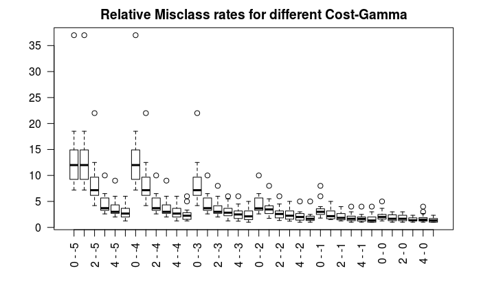

The range of parameters used in the model comparison:
| Model | parameters | 
|---------| --------------|
| KNN | K = (1, 2, 3,...., 40)
| Random Forest | grid of  mtry = (6, 8, 9, 10, 12) and nodesizes = (2, 3, 4, 5, 6) |
| Neural Network | grid of size = (2, 6, 9, 12) and decay=(0, 0.001, 0.01, 0.1) |
| SVM | grid of cost = (1, 10, 10<sup>2</sup>, 10<sup>3</sup>, 10<sup>4</sup>, 10<sup>5</sup>) and sigma = (10<sup>-5</sup>, 10<sup>-4</sup>, 10<sup>-3</sup>, 10<sup>-2</sup>, 10<sup>-1</sup>,1)

## II. Model Evaluation:

#### 10-fold cross validation
> * In order to obtain a more robust evaluation of these methods, it is important average results from multiple splits. This reduces variability of misclassification error calculation and allows maintaining larger train sets by utilizing the entire dataset for learning.
> * It is also important to tune the models using an inner-CV in each split so that all models use their best hyper-parameters for that split for a fair comparison in the end.

1.  At each fold, tuned all models using cross validation on the fold’s train data.
2.  Tested on the fold’s test data and noted the test error for the split.
3. Note misclassification error rates for each model and for each split.

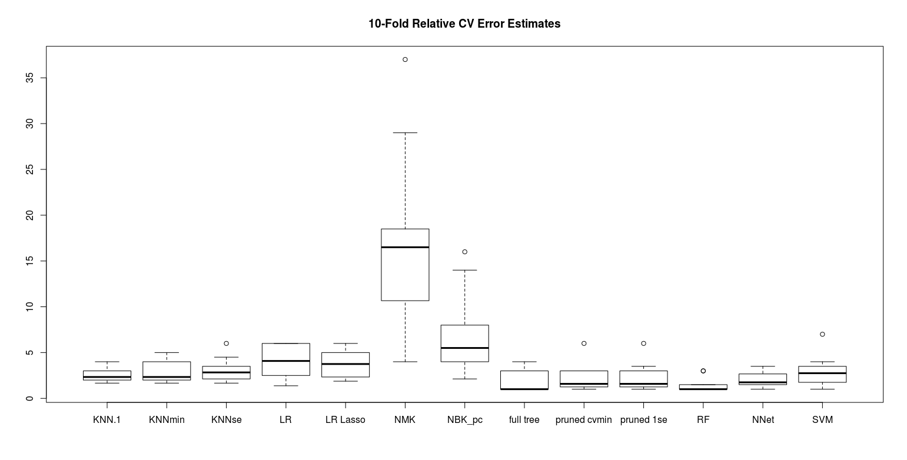

*   Random Forest is the best performing model.
*   Tree-based classifiers have comparable means but higher model variability.
*   Naive Bayes is clearly not a good choice for this data.

#### Misclassification Error Rates:

| | Train Error | Test Error | 
|----| ---- | ---|
| Tuned KNN (k1se=3) | 0.148 | |
| Logistic Regression | 0.134 | 0.197 |
| Logistic Regression (LASSO) | 0.134 | 0.148 |
| Linear Discriminant Analysis | 0.25 | 0.33 |
| Naive Bayes | 0.13 | 0.22 |
| Single Tree (Pruned 1se) | 0.06 | 0.09 |
| **Tuned Random Forest  (mtry=8, nodesize=2)** | **0.002** | **0.06** |
| Tuned Neural Network (size=9, decay=0.001) | 0.04 | 0.15 |
| Tuned SVM  (cost=105, sigma=100) | 0 | 0.57 |

 ## IV. Random Forest - The Winning Model
 
* **Confusion Matrix =**
 
| | allow | deny | drop | reset-both |
|-|-------|------|------|-----------|
| **allow**| 38 | 0 | 0 | 0 |
| **deny**| 4 | 38 | 0 | 3 |
| **drop**| 0 | 1 | 41 | 0 |
| **reset-both**| 0 | 6 | 0 | 35 |

* **Misclassification Rate = 0.062**

## V. Conclusion

*  The first class <em>allow</em> having zero misclassifications seems to be the easiest to predict.
*  There exists some uncertainty in predicting classes <em>reset-both</em> as <em>deny</em>. 
*  There is a small misclassification error for <em>deny</em> as <em>allow</em> that can be concerning. These errors may possibly be reduced by improving the size and quality of data (including Source and Destination IP addresses, captcha information, etc).

# Usage

The data is present in the folder ```./data/``` in CSV file format as ```log2.csv```.
1. Find the hyper-parameter range on a train-test split, run the notebook in an Rstudio IDE.
	```Proj.Rmd```

2. Evaluate the models:
	```Rscript proj_cv.R```

3.  Best Model Random Forest for classification:
	```Rscript rf_tuning.R```